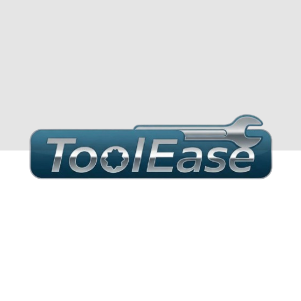

# ToolEase

<div align="center">



**A Flutter-based inventory management kiosk application for Android tablets**

*Streamlining equipment borrowing and returning for educational institutions*

[](https://flutter.dev)
[](https://dart.dev)
[](LICENSE)

</div>

## 📖 Overview

ToolEase is a comprehensive inventory management system designed specifically for educational institutions. Built as a kiosk application for Android tablets, it provides a streamlined interface for students to borrow and return equipment while giving administrators powerful tools to manage inventory, track usage, and generate reports.

### Key Features

- **🎯 Dual Interface**: Student-facing kiosk mode and secure admin panel
- **📱 Kiosk-Ready**: Optimized for tablet deployment with restricted navigation
- **🔐 Secure Authentication**: Device PIN/biometric authentication for admin access
- **📊 Real-time Tracking**: Live inventory updates and comprehensive reporting
- **🏷️ Smart ID System**: Auto-generated borrow IDs with year-based prefixing

## 🚀 Quick Start

### Prerequisites

- **Flutter SDK**: 3.32.8 or higher
- **Dart SDK**: 3.8.1 or higher
- **Android Studio**: Latest version with Android SDK
- **Android Device**: API level 24+ (Android 7.0)

### Installation

1. **Clone the repository**
   ```bash
   git clone https://github.com/xoftwer/toolease.git
   cd toolease
   ```

2. **Install dependencies**
   ```bash
   flutter pub get
   ```

3. **Generate database code**
   ```bash
   flutter packages pub run build_runner build
   ```

4. **Run the application**
   ```bash
   flutter run
   ```

### Build for Production

```bash
# Build APK for release
flutter build apk --release

# Build App Bundle for Play Store
flutter build appbundle --release
```

## 🏗️ Architecture

ToolEase follows clean architecture principles with a clear separation of concerns:

```
lib/
├── core/              # Design system, themes, extensions
├── database/          # Drift ORM, tables, and generated code
├── models/            # Data models and business entities
├── providers/         # Riverpod state management
├── screens/           # UI screens and widgets
├── services/          # Business logic and external services
├── shared/            # Reusable widgets and utilities
└── utils/             # Helper functions and utilities
```

### Technology Stack

- **Frontend**: Flutter with Material Design 3
- **State Management**: Riverpod
- **Database**: Drift (SQLite)
- **Authentication**: local_auth package
- **Navigation**: MaterialApp with named routes
- **Reports**: PDF generation and file export

## 📱 Features

### Student Features (Public Access)
- **Self Registration**: Quick student profile creation
- **Item Borrowing**: Browse and borrow available equipment
- **Item Return**: Return borrowed items with condition tracking
- **User Manual**: Built-in help and usage instructions

### Admin Features (Authenticated Access)
- **Dashboard**: Real-time system overview and metrics
- **Inventory Management**: Full CRUD operations for items and storages
- **Student Management**: View and manage student records
- **Records Tracking**: Monitor active borrows and returns
- **Item Restoration**: Restore lost and damaged items back to available stock
  - Mark lost items as replaced
  - Mark damaged items as repaired
- **Advanced Reporting**: Generate PDF reports
- **System Settings**: Configure app behavior and features
- **User Manual**: Comprehensive admin documentation

### Core System Features
- **Kiosk Mode**: Secure tablet deployment with gesture-based admin access
- **Real-time Updates**: Live inventory tracking with quantity management and instant dashboard sync
- **Condition Tracking**: Individual item condition monitoring (Good/Damaged/Lost)
- **Item Restoration System**: Comprehensive lost/damaged item recovery with stock restoration
- **Data Export**: Comprehensive reporting and data export capabilities
- **Accessibility**: Full screen reader support and high contrast mode

## 🔧 Configuration

### Kiosk Mode Setup

1. Enable kiosk mode in admin settings
2. Deploy on Android tablet in kiosk mode
3. Use 5-tap gesture to access admin features
4. Configure permitted operations through settings panel

### Database Configuration

The application uses Drift (SQLite) for local data storage. Key tables include:
- `Students`: Student registration data
- `Items`: Inventory items with quantities
- `Storages`: Physical storage locations
- `BorrowRecords`: Transaction tracking
- `Settings`: App configuration

## 📊 Usage

### For Students
1. **Register**: Create student profile with ID, name, and class details
2. **Borrow**: Select items, specify quantities, receive borrow ID
3. **Return**: Enter student ID, mark item conditions, complete return

### For Administrators
1. **Access**: Authenticate using device PIN/biometric
2. **Manage**: Add/edit items, storages, and student records
3. **Monitor**: View dashboard metrics and active transactions
4. **Restore**: Recover lost and damaged items back to available stock
5. **Report**: Generate detailed usage and inventory reports

## 🧪 Testing

```bash
# Run all tests
flutter test

# Run tests with coverage
flutter test --coverage

# Analyze code quality
flutter analyze
```

## 🚀 Deployment

### Development Deployment
```bash
# Run in debug mode
flutter run --debug

# Run in profile mode for performance testing
flutter run --profile
```

### Production Deployment
```bash
# Build release APK
flutter build apk --release

# Install on device
flutter install --release
```

## 🤝 Contributing

We welcome contributions to ToolEase! Please follow these guidelines:

### Development Process
1. Fork the repository
2. Create a feature branch (`git checkout -b feature/amazing-feature`)
3. Follow the coding standards defined in `CLAUDE.md`
4. Write tests for new functionality
5. Commit changes (`git commit -m 'Add amazing feature'`)
6. Push to branch (`git push origin feature/amazing-feature`)
7. Open a Pull Request

### Code Standards
- Follow Dart/Flutter best practices
- Use the established design system
- Implement proper error handling
- Add documentation for complex logic
- Ensure accessibility compliance

## 📄 Documentation

- **[CLAUDE.md](CLAUDE.md)**: Development guidelines and architecture details
- **[TODO.md](TODO.md)**: Project roadmap and task management
- **User Manuals**: Built into the application for both students and admins

## 🐛 Issues and Support

- **Bug Reports**: Use GitHub Issues with the `bug` label
- **Feature Requests**: Use GitHub Issues with the `enhancement` label
- **Questions**: Use GitHub Discussions for general questions

## 📜 License

This project is licensed under the MIT License - see the [LICENSE](LICENSE) file for details.

## 👥 Authors

- **Development Team** - *Initial work and ongoing maintenance*

## 🙏 Acknowledgments

- Flutter team for the excellent framework
- Drift team for the robust ORM solution
- Riverpod community for state management guidance
- Material Design team for design system inspiration

---

<div align="center">

**ToolEase** - *Simplifying inventory management for educational institutions*

</div>
